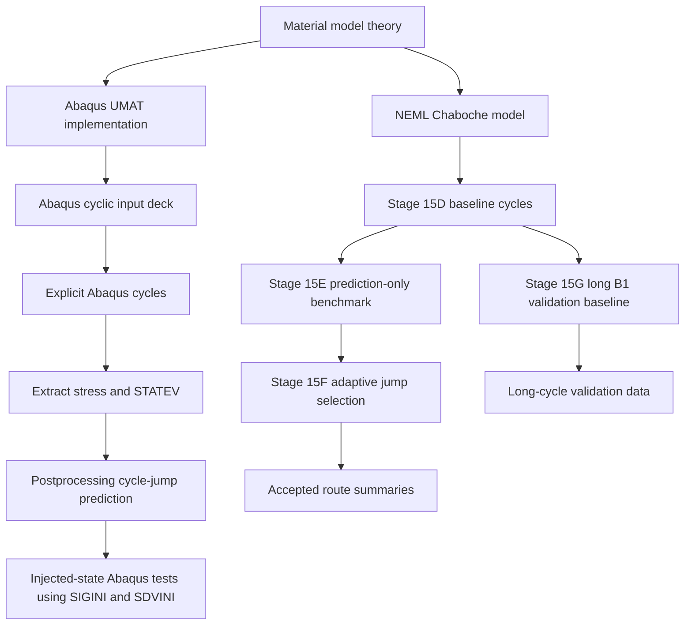
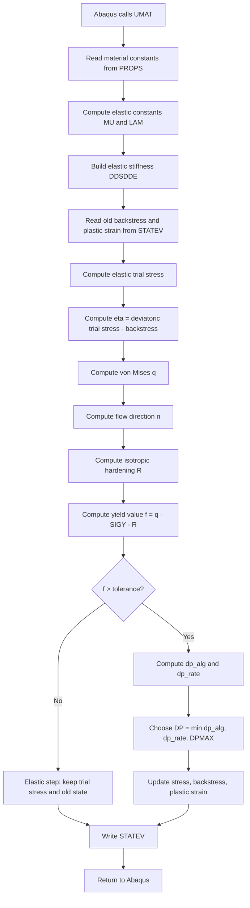
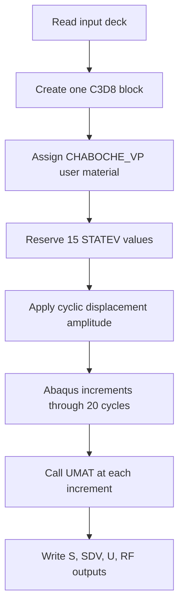
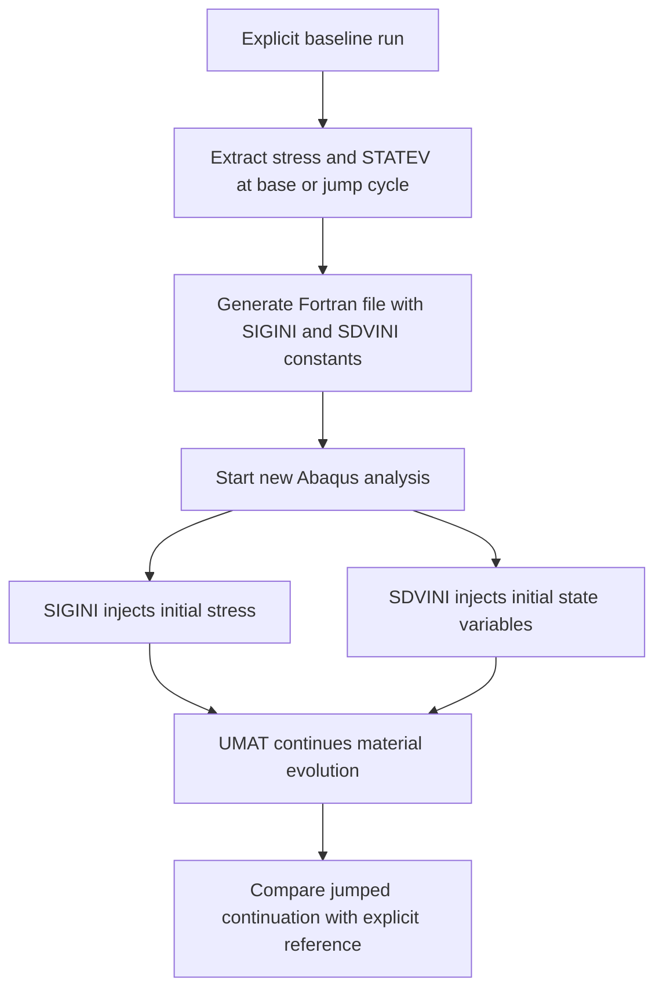
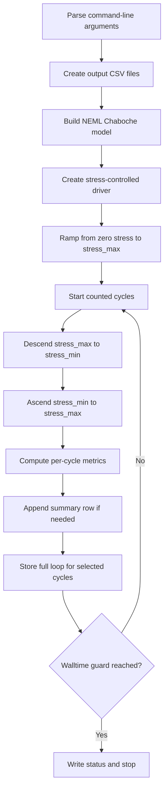
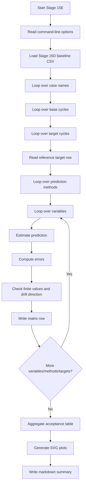
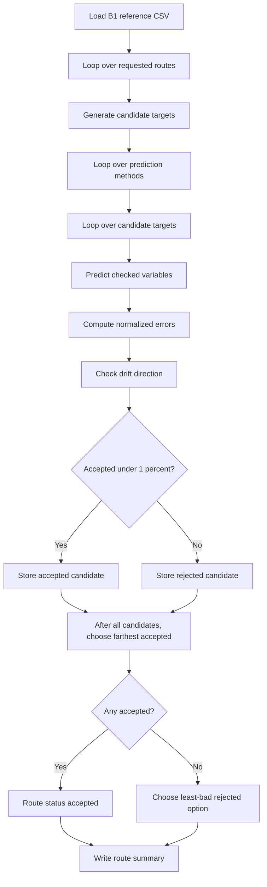
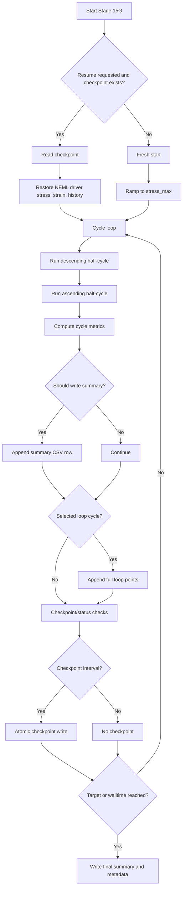
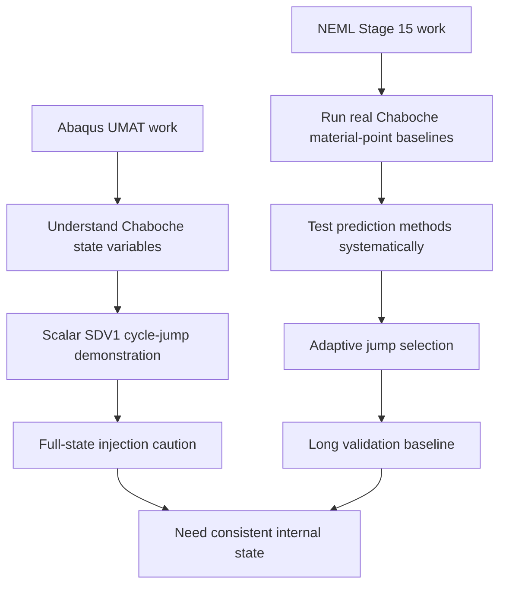
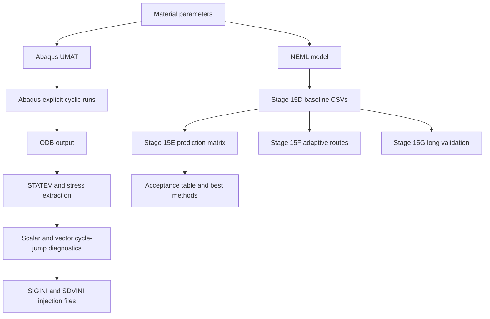

# Detailed Report: Chaboche UMAT, Abaqus Cycle Jump, and Stage 15 Real-NEML Workflow

This report explains the listed Python, Fortran, Abaqus input, and project-report files from first principles. It is written for a beginner who may be new to cyclic plasticity, Abaqus UMATs, NEML, and cycle-jump acceleration.

## 1. Big Picture

The project studies cyclic plasticity and cycle-jump prediction for a Chaboche-type material model.

In plain language:

1. A material is loaded repeatedly.
2. Each cycle changes the internal material state a little.
3. Running every cycle explicitly can be very expensive.
4. A cycle-jump method tries to predict the material state at a later cycle without simulating every intermediate cycle.
5. The prediction must be checked against a trustworthy baseline.

There are two main implementation tracks in the files:

- The Abaqus/Fortran track implements a simplified Chaboche/Perzyna UMAT and tests state injection with `SIGINI` and `SDVINI`.
- The Stage 15 Python/NEML track uses the open-source NEML library to run and benchmark Chaboche ratcheting simulations outside Abaqus.

The Stage 15 workflow is mainly a benchmark and validation workflow. It asks:

- What does the real material model do cycle by cycle?
- Can we predict later cycles from earlier cycles?
- How large can a jump be before the prediction becomes unacceptable?
- Can long baseline data validate the cycle-jump idea?

## 2. Files Covered

Main Stage 15 files:

- `runs/chaboche_umat/stage15_open_source_chaboche_ratchet_model/stage15d_real_neml_full_baseline/stage15d_real_neml_baseline_worker.py`
- `runs/chaboche_umat/stage15_open_source_chaboche_ratchet_model/stage15e_real_neml_cycle_jump_benchmark/stage15e_real_neml_cycle_jump_controller.py`
- `runs/chaboche_umat/stage15_open_source_chaboche_ratchet_model/stage15e_real_neml_cycle_jump_benchmark/stage15e_cycle_jump_methods.py`
- `runs/chaboche_umat/stage15_open_source_chaboche_ratchet_model/stage15f_adaptive_real_neml_cycle_jump/stage15f_adaptive_controller.py`
- `runs/chaboche_umat/stage15_open_source_chaboche_ratchet_model/stage15g_real_neml_long_b1_validation_baseline/stage15g_real_neml_long_b1_runner.py`
- `runs/chaboche_umat/stage15_open_source_chaboche_ratchet_model/stage15g_real_neml_long_b1_validation_baseline/stage15g_checkpoint_utils.py`

Main Abaqus/Fortran files:

- `runs/chaboche_umat/umat/chaboche_vp_v1_working.f`
- `runs/chaboche_umat/umat_chaboche_v1_with_sdvini_sigini.f`
- `runs/chaboche_umat/chaboche_vp_v1_cyclic_eps005_20cycles.inp`
- `runs/chaboche_umat/stage12_percentage_jump_1000cycles/jump35_cycle350_to_cycle1000/umat_chaboche_v1_with_sdvini_sigini_predicted_cycle350.f`

Useful project reports:

- `runs/chaboche_umat/CHABOCHE_DEBUG_REPORT.md`
- `runs/chaboche_umat/CHABOCHE_CYCLE_JUMP_PREDICTION_REPORT.md`
- `docs/stage15_real_neml_cycle_jump_package/02_STAGE15E_METHOD.md`
- `runs/chaboche_umat/stage15_open_source_chaboche_ratchet_model/stage15f_adaptive_real_neml_cycle_jump/STAGE15F_MASTER_SUMMARY.md`

## 3. Beginner Glossary

| Term | Meaning |
|---|---|
| Stress | Internal force per area. In this project, stress values are usually treated like MPa. |
| Strain | Relative deformation. A strain of `0.005` means `0.5%` elongation/compression. |
| Elasticity | Reversible deformation. Remove the load and the material returns to its old shape. |
| Plasticity | Permanent deformation. Remove the load and some deformation remains. |
| Viscoplasticity | Plasticity with rate dependence. The amount of plastic flow depends on time or strain rate. |
| Yield stress | Stress level where plastic deformation begins. |
| Hardening | The material changes its resistance to plastic flow as it deforms. |
| Isotropic hardening | The yield surface expands equally in all directions. |
| Kinematic hardening | The yield surface translates in stress space. This is important for cyclic loading. |
| Backstress | Internal stress-like variable used for kinematic hardening. |
| Chaboche model | A nonlinear kinematic hardening model, often using one or more backstress components. |
| Perzyna model | A viscoplastic overstress rule. Plastic flow occurs at a rate controlled by overstress. |
| UMAT | Abaqus user-material subroutine written in Fortran. Abaqus calls it at each material point. |
| STATEV / SDV | Solution-dependent state variables stored by Abaqus between increments. |
| NEML | Nuclear Engineering Material Library, an open-source material model library. |
| Ratcheting | Progressive accumulation of mean strain during asymmetric cyclic stress loading. |
| Hysteresis loop | Stress-strain loop traced during one loading/unloading cycle. |
| Cycle jump | Predicting a later cycle without explicitly computing every skipped cycle. |
| Base cycle | Last known cycle used as the starting point for prediction. |
| Target cycle | Future cycle being predicted. |
| Normalized error | Error divided by a meaningful scale, here usually the reference strain range. |

## 4. Theory: What Problem Is Being Solved?

### 4.1 Cyclic Plasticity

When a metal is loaded and unloaded repeatedly, its response may not repeat perfectly. Several things can happen:

- It may shake down to elastic behavior.
- It may form a stable hysteresis loop.
- It may keep accumulating plastic strain.
- It may ratchet, meaning the mean strain drifts cycle by cycle.

For asymmetric stress cycling, for example stress cycling between `-150` and `+250`, the tensile and compressive parts are not balanced. That imbalance can cause progressive strain drift. This is ratcheting.

### 4.2 Why Chaboche Hardening?

Simple plasticity with only isotropic hardening often cannot represent cyclic effects well. Cyclic plasticity needs memory of load direction. Kinematic hardening provides that memory by using backstress.

The Chaboche model represents backstress as one or more internal variables. A common idea is:

```text
total backstress X = X_1 + X_2 + X_3 + ...
```

Each backstress branch has its own stiffness-like parameter `C_i` and recovery parameter `gamma_i`.

- Large `C_i` means the branch responds strongly to plastic flow.
- Large `gamma_i` means the branch recovers/saturates quickly.
- Multiple branches allow the model to capture both fast and slow transient cyclic behavior.

### 4.3 Yield Surface and Effective Stress

Plasticity is driven by the effective deviatoric stress:

```text
eta = dev(sigma) - X
```

where:

- `sigma` is the stress tensor.
- `dev(sigma)` is the deviatoric part of stress, meaning the hydrostatic pressure part is removed.
- `X` is backstress.

The von Mises equivalent stress is:

```text
q = sqrt(3/2 * eta:eta)
```

Plasticity starts when:

```text
f = q - sigma_y - R > 0
```

where:

- `sigma_y` is the initial yield stress.
- `R` is isotropic hardening.
- `f` is the overstress or yield function value.

If `f <= 0`, the step is elastic.

If `f > 0`, plastic flow occurs.

### 4.4 Voce Isotropic Hardening

The project uses Voce isotropic hardening:

```text
R = Q * (1 - exp(-b * p))
```

where:

- `R` is the current isotropic hardening.
- `Q` is the saturation value.
- `b` controls how quickly saturation is approached.
- `p` is accumulated plastic or viscoplastic strain.

The behavior:

- At `p = 0`, `R = 0`.
- As `p` grows, `R` increases.
- At very large `p`, `R` approaches `Q`.

### 4.5 Chaboche Kinematic Hardening

The simplified Abaqus UMAT uses one backstress tensor `X`. The update has the form:

```text
X_new = (X_old + (2/3) * C * dp * n) / (1 + gamma * dp)
```

where:

- `C` is the kinematic hardening modulus.
- `gamma` is the dynamic recovery coefficient.
- `dp` is the plastic multiplier increment.
- `n` is the plastic flow direction.

The numerator increases backstress in the flow direction. The denominator creates nonlinear recovery and prevents unlimited growth.

The Stage 15 NEML model is richer because it uses three backstress branches:

```text
C     = [80000.0, 14000.0, 3333.0]
gamma = [900.0, 1500.0, 1.0]
```

This is the `P2_three_backstress_screen` parameter set.

### 4.6 Perzyna Viscoplasticity in the Abaqus UMAT

The Abaqus UMAT estimates a plastic increment in two ways:

```text
dp_alg  = f / hardening_modulus
dp_rate = dt * (f / KVIS)^MVIS
dp      = min(dp_alg, dp_rate, DPMAX)
```

where:

- `dp_alg` is a radial-return-like correction.
- `dp_rate` is the Perzyna rate-limited increment.
- `KVIS` is viscosity scale.
- `MVIS` is overstress exponent.
- `DPMAX` caps the maximum plastic increment for numerical robustness.

This is a simplified implementation. It was built as a working/debugging model rather than a final production-grade implicit integration algorithm.

### 4.7 Ratcheting Metrics Used in Stage 15

The Python/NEML scripts compute per-cycle values:

```text
strain_min   = minimum strain in the cycle
strain_max   = maximum strain in the cycle
strain_mean  = 0.5 * (strain_min + strain_max)
strain_range = strain_max - strain_min
```

The ratcheting strain is:

```text
ratcheting_strain = strain_mean - first_cycle_strain_mean
```

This measures accumulated drift of the hysteresis loop center.

The hysteresis area is approximated by trapezoidal integration:

```text
area = integral stress d(strain)
```

In code, this is computed by a simple trapezoidal rule over the cycle points.

## 5. Complete Workflow Flowchart



## 6. Abaqus/Fortran Track

### 6.1 File: `umat/chaboche_vp_v1_working.f`

This is the core Abaqus UMAT. Abaqus calls `UMAT` during each increment at each integration point.

The UMAT receives:

- Current stress from the previous increment.
- Current state variables from the previous increment.
- Strain increment `DSTRAN`.
- Material properties `PROPS`.
- Time increment `DTIME`.

The UMAT returns:

- Updated stress `STRESS`.
- Updated state variables `STATEV`.
- Tangent stiffness `DDSDDE`.
- Energy quantities such as `SSE`.

#### Material properties

The Abaqus input file passes nine constants:

| PROPS index | Name | Meaning |
|---:|---|---|
| 1 | `E` | Young's modulus |
| 2 | `NU` | Poisson's ratio |
| 3 | `SIGY` | Initial yield stress |
| 4 | `QISO` | Voce isotropic hardening saturation |
| 5 | `BISO` | Voce isotropic hardening rate |
| 6 | `CKIN` | Kinematic hardening modulus |
| 7 | `GKIN` | Backstress recovery coefficient |
| 8 | `KVIS` | Perzyna viscosity scale |
| 9 | `MVIS` | Perzyna overstress exponent |

#### State variables

The UMAT uses 15 state variables:

| STATEV index | Meaning |
|---:|---|
| 1 | accumulated viscoplastic strain `p` |
| 2-7 | backstress tensor `X` in Abaqus order |
| 8-13 | viscoplastic strain tensor `Ep` |
| 14 | isotropic hardening `R` |
| 15 | plastic increment `DP` from the current increment |

Abaqus tensor order in this UMAT is:

```text
11, 22, 33, 12, 13, 23
```

#### UMAT algorithm

The core UMAT logic is:



#### Important beginner detail: elastic predictor, plastic corrector

Most plasticity codes follow this pattern:

1. Pretend the whole increment is elastic.
2. Check if that trial stress violates the yield condition.
3. If not, accept it.
4. If yes, correct the stress back toward the yield surface and update internal variables.

This is called an elastic predictor/plastic corrector structure.

#### Why `DPMAX` exists

The file sets:

```text
DPMAX = 1.0e-3
```

This limits the plastic increment in one Abaqus increment. It improves robustness for this demonstration model, but it also means the solution can depend on the time increment schedule. That sensitivity is documented in the project reports.

### 6.2 File: `umat_chaboche_v1_with_sdvini_sigini.f`

This file contains three subroutines:

- `UMAT`
- `SIGINI`
- `SDVINI`

The `UMAT` is essentially the same Chaboche/Perzyna update as `chaboche_vp_v1_working.f`.

The extra subroutines are for state injection.

#### `SIGINI`

`SIGINI` initializes stress before the first increment.

In this file, it injects a stress extracted from cycle 19:

```text
SIGMA(1) = 335.5768737792969
SIGMA(2..6) = 0
```

The idea is:

1. Run a baseline simulation.
2. Extract the stress at a chosen cycle.
3. Start a new Abaqus run from that stress instead of from zero.

#### `SDVINI`

`SDVINI` initializes `STATEV` before the first increment.

In this file, it injects cycle-19 state values:

- accumulated viscoplastic strain,
- backstress components,
- viscoplastic strain components,
- isotropic hardening,
- reset last increment `DP`.

#### Why both `SIGINI` and `SDVINI` are needed

A material state is not only the scalar accumulated plastic strain. For cyclic plasticity, stress and internal variables must be consistent.

If you inject only `STATEV(1)` but not backstress or stress, the material may start from an inconsistent state. The next Abaqus increment may then produce wrong stress, convergence problems, or inaccurate continuation.

The project reports correctly identify this issue: scalar `SDV1` prediction is easier than full consistent state injection.

### 6.3 File: `chaboche_vp_v1_cyclic_eps005_20cycles.inp`

This is an Abaqus input deck for a 20-cycle strain-controlled test.

#### Geometry

It creates one 3D brick:

- Length in x direction: `10.0`
- Height: `2.0`
- Width: `2.0`
- Element type: `C3D8`

The model is intentionally simple. It is a one-element material-point-style test.

#### Material

It assigns:

```text
*MATERIAL, NAME=CHABOCHE_VP
*DEPVAR
15
*USER MATERIAL, CONSTANTS=9
210000.0, 0.3, 520.0, 200.0, 0.05, 120000.0, 800.0, 1000.0, 5.0
```

That means:

- Abaqus reserves 15 state variables.
- Abaqus passes 9 constants into the UMAT.

#### Boundary conditions

The left face is fixed in x. The right face is displaced cyclically in x.

The displacement amplitude is:

```text
U = 0.05
```

Because the length is `10.0`, the strain amplitude is:

```text
eps_amp = 0.05 / 10.0 = 0.005
```

So this is a `0.5%` strain-amplitude cyclic test.

#### Cyclic amplitude

One cycle is represented by:

```text
0.00 -> 0
0.25 -> +1
0.50 -> 0
0.75 -> -1
1.00 -> 0
```

That pattern repeats until time `20.0`, giving 20 cycles.

#### Abaqus input flowchart



### 6.4 File: `stage12.../umat_chaboche_v1_with_sdvini_sigini_predicted_cycle350.f`

This file is similar to the cycle-19 injection file, but it injects a predicted/extracted cycle-350 state for a larger jump route:

```text
cycle 350 -> cycle 1000
```

It contains:

- the same UMAT logic,
- `SIGINI` with cycle-350 stress,
- `SDVINI` with cycle-350 state variables.

The purpose is to test whether Abaqus can skip earlier cycles by starting from a predicted later internal state.

Important: the file comments say "predicted/extracted cycle-350". The exact scientific validity depends on how accurate the injected stress and full state vector are. The project reports show that full-state consistency is the hard part.

### 6.5 Abaqus State-Injection Flowchart



## 7. Stage 15 NEML Track

Stage 15 moves the model exploration into NEML. NEML is a material-model library, so the Python scripts can run constitutive cycles without building a full Abaqus finite element model.

This is useful because:

- It is faster to run material-point tests.
- It avoids Abaqus licensing and compiler setup for baseline generation.
- It allows systematic benchmark tables.
- It still uses a real Chaboche material model rather than a toy linear rule.

## 8. Shared Stage 15 Material Model

Several Stage 15 scripts use the same parameter set:

```python
P2 = {
    "E": 200000.0,
    "nu": 0.3,
    "yield_stress": 100.0,
    "Q": 50.0,
    "b": 5.0,
    "C": [80000.0, 14000.0, 3333.0],
    "gamma": [900.0, 1500.0, 1.0],
    "A": [0.0, 0.0, 0.0],
    "a": [1.0, 1.0, 1.0],
}
```

Meaning:

- `E` and `nu` define isotropic elasticity.
- `yield_stress` defines the initial yield threshold.
- `Q` and `b` define Voce isotropic hardening.
- `C` and `gamma` define three Chaboche backstress branches.
- `A = 0` disables optional extra nonlinear terms.

The NEML model is built as:

```text
elasticity -> yield surface -> hardening -> flow rule -> small-strain plasticity model
```

Flowchart:


## 9. Stage 15D: Baseline Worker

File:

`stage15d_real_neml_baseline_worker.py`

### Purpose

Stage 15D generates the baseline truth data. It runs a stress-controlled NEML simulation one cycle at a time.

It does not jump cycles. It computes cycles explicitly until a walltime guard stops the job.

This baseline is later used by Stage 15E and Stage 15F to test predictions.

### Important functions

#### `require_neml()`

Imports NEML lazily.

Why lazy import matters:

- The script may be submitted on an HPC cluster.
- The NEML module may only exist after loading cluster modules.
- The script can parse and start cleanly, then fail at runtime if NEML is missing.

#### `build_model(modules)`

Builds the NEML Chaboche model using the `P2` parameter set.

Steps:

1. Create isotropic elastic model.
2. Create J2 yield surface with isotropic/kinematic hardening.
3. Create Voce isotropic hardening.
4. Create three constant-gamma backstress branches.
5. Create Chaboche hardening model.
6. Create rate-independent flow rule.
7. Return small-strain plasticity model.

#### `history_metrics(history, names)`

Extracts useful scalar diagnostics from the NEML internal history vector:

- accumulated inelastic strain `alpha`,
- Euclidean norm of all backstress components.

This is helpful because NEML stores internal variables in a vector. The function translates that vector into readable diagnostics.

#### `trapz(xs, ys)`

Computes hysteresis loop area using the trapezoidal rule.

The code integrates stress with respect to strain:

```text
hysteresis_area = integral stress d(strain)
```

#### `run(args)`

This is the main simulation loop.

High-level sequence:



### Stress-controlled cycle

The script uses:

```python
sdir = np.array([1.0, 0, 0, 0, 0, 0])
```

This means loading is along the 11-direction.

Each cycle is split into two half-cycles:

1. stress goes from `stress_max` to `stress_min`,
2. stress goes from `stress_min` back to `stress_max`.

The driver call is:

```python
driver.srate_sinc_step(sdir, args.srate, inc, args.temperature)
```

That advances the material state by one stress increment.

### Output files

For each case, Stage 15D writes:

- `<case_name>_cycle_summary.csv`
- `<case_name>_selected_loops.csv`
- `<case_name>_status.txt`

The summary CSV contains:

- cycle number,
- stress min/max,
- strain min/max,
- strain mean,
- strain range,
- ratcheting strain,
- hysteresis area,
- accumulated inelastic strain,
- backstress norm,
- runtime metrics.

### Why selected loops are saved only at some cycles

Full loop data for every cycle would become huge. The script saves full loops only at cycles like:

```text
1, 2, 5, 10, 20, 50, 100, ..., 1000000
```

This gives enough data to inspect loop shape without filling storage.

## 10. Stage 15E: Cycle-Jump Benchmark Controller

Files:

- `stage15e_real_neml_cycle_jump_controller.py`
- `stage15e_cycle_jump_methods.py`
- `docs/stage15_real_neml_cycle_jump_package/02_STAGE15E_METHOD.md`

### Purpose

Stage 15E does not run new NEML cycles. It reads the Stage 15D baseline data and tests prediction methods.

It asks:

```text
If I know the solution up to base cycle N,
can I predict the value at target cycle M?
```

### Benchmark grid

The benchmark loops over:

- case names,
- base cycles,
- target cycles,
- prediction methods,
- variables.

One combination is called a lane:

```text
case + base_cycle + target_cycle + method
```

For each lane, the controller predicts multiple variables.

### Variables

Primary variables:

- `strain_mean`
- `ratcheting_strain`

Secondary variables:

- `strain_max`
- `strain_min`
- `strain_range`
- `hysteresis_area`

The primary variables matter most because they describe ratcheting.

### Prediction methods

From `stage15e_cycle_jump_methods.py`:

```text
linear_last_2
linear_last_5
linear_last_10
linear_last_20
least_squares_last_20
least_squares_last_50
least_squares_last_100
```

All methods use the same final prediction formula:

```text
y_pred(target) = y(base) + slope * (target - base)
```

The difference is how the slope is estimated.

#### `linear_last_N`

Uses the first and last points in the window:

```text
slope = (y_last - y_first) / (cycle_last - cycle_first)
```

This is simple and local.

#### `least_squares_last_N`

Fits a straight line through all selected window points using least squares.

This is smoother because all points contribute to the slope estimate.

### Error metrics

For each prediction:

```text
absolute_error = abs(predicted - reference)
relative_error_percent = 100 * absolute_error / abs(reference)
normalized_error_percent = 100 * absolute_error / strain_range_reference
```

Normalized error is important because it compares error to the size of the strain loop. This makes errors more comparable across cases.

### Drift direction check

The prediction must move in the same direction as the reference:

```text
predicted_drift = predicted - base_value
reference_drift = reference - base_value
```

If the reference increases but the prediction decreases, the method is rejected even if the absolute error is small.

### Stage 15E controller flowchart



### Output files

Stage 15E writes:

- `STAGE15E_CYCLE_JUMP_MATRIX.csv`
- `STAGE15E_CYCLE_JUMP_ERRORS.csv`
- `STAGE15E_ACCEPTANCE_TABLE.csv`
- `STAGE15E_BEST_METHODS_BY_TARGET.csv`
- `plots/*.svg`
- `STAGE15E_MASTER_SUMMARY.md`

### Acceptance logic

The controller groups rows by lane:

```text
case_name, base_cycle, target_cycle, method
```

Then it checks:

- all required values are finite,
- drift direction is correct,
- primary errors are below threshold,
- peak strain errors are below threshold when available.

Thresholds:

- strict: `<= 1%`
- relaxed: `<= 2%`
- relaxed: `<= 5%`

## 11. Stage 15F: Adaptive Real-NEML Cycle Jump

File:

`stage15f_adaptive_controller.py`

### Purpose

Stage 15F asks a more practical question:

```text
If the requested jump is too large,
what is the largest smaller jump that is acceptable?
```

It uses B1 reference data:

```text
B1_stress_m150_to_250
```

This is the asymmetric stress-controlled case from `-150` to `+250`.

### Routes

The script tests requested routes:

```text
500 -> 1000
1000 -> 5000
5000 -> 10000
10000 -> 50000
50000 -> 100000
100000 -> 200000
```

For each route, it tests methods and candidate target cycles.

### Candidate target generation

If base is `10000` and requested target is `50000`, candidates are generated by repeatedly halving the jump length:

```text
50000, 30000, 20000, 15000, 12500, ...
```

The actual code does:

```python
current = base + max(1, (current - base) // 2)
```

It then sorts candidates from largest to smallest.

### Prediction methods in Stage 15F

Stage 15F uses more varied methods than Stage 15E:

```text
local_linear
least_squares_local_linear
power_law_fit
log_cycle_fit
quadratic_curvature_limited
```

#### `local_linear`

Uses a recent local slope.

#### `least_squares_local_linear`

Fits a straight line over a wider local window.

#### `power_law_fit`

Fits:

```text
y = a * cycle^exponent
```

in log space.

This can represent decelerating or accelerating trends better than a straight line.

#### `log_cycle_fit`

Fits:

```text
y = m * log(cycle) + c
```

This is useful when changes become slower with cycle count.

#### `quadratic_curvature_limited`

Fits a quadratic trend but caps curvature so the prediction cannot explode.

This is a conservative nonlinear extrapolation method.

### Stage 15F evaluation

Stage 15F checks three variables:

```text
strain_mean
ratcheting_strain
strain_max
```

For each variable, it computes normalized error. A candidate is accepted when:

- all values are finite,
- drift direction is correct,
- maximum normalized error among checked variables is `<= 1%`.

### Stage 15F flowchart



### Results from `STAGE15F_MASTER_SUMMARY.md`

All six requested routes found accepted adaptive choices:

| Base | Requested target | Chosen target | Method | Max normalized error percent |
|---:|---:|---:|---|---:|
| 500 | 1000 | 1000 | `local_linear` | 0.456158 |
| 1000 | 5000 | 5000 | `quadratic_curvature_limited` | 0.111568 |
| 5000 | 10000 | 10000 | `local_linear` | 0.750589 |
| 10000 | 50000 | 15000 | `local_linear` | 0.313542 |
| 50000 | 100000 | 100000 | `quadratic_curvature_limited` | 0.757465 |
| 100000 | 200000 | 106250 | `least_squares_local_linear` | 0.0734935 |

The key lesson is not that every requested jump is accepted exactly. Some routes are shortened. For example:

```text
10000 -> 50000
```

was reduced to:

```text
10000 -> 15000
```

That is what makes the method adaptive.

## 12. Stage 15G: Long B1 Validation Baseline

Files:

- `stage15g_real_neml_long_b1_runner.py`
- `stage15g_checkpoint_utils.py`

### Purpose

Stage 15G runs a long real-NEML baseline for B1:

```text
stress cycles from -150 to +250
target cycles = 2,000,000 by default
```

This is a validation baseline. It is designed for long-running HPC jobs and can resume from checkpoints.

### What makes Stage 15G different from Stage 15D?

Stage 15D is a general baseline worker with command-line case parameters.

Stage 15G is a fixed long B1 validation runner with:

- fixed case name,
- fixed B1 stress range,
- fixed 40 points per cycle,
- selected preserved cycles,
- checkpoint and resume support.

### Checkpointing

Long HPC jobs may be stopped by walltime limits. Stage 15G writes a checkpoint containing:

- current cycle,
- target cycle,
- elapsed time,
- first mean strain,
- last summary row,
- current stress vector,
- current strain vector,
- current internal history vector.

The helper function `atomic_write_json` writes to a temporary file and then replaces the old checkpoint. This prevents corrupted checkpoint files if the job is killed during writing.

### Stage 15G run flowchart



### Important functions

#### `should_write_summary(cycle, final_cycle=False)`

Controls summary output density.

It writes:

- every cycle up to 10000,
- cycles divisible by 100 or 1000,
- important preserved cycles,
- final cycle.

This balances detail and file size.

#### `restore_driver_state(driver, checkpoint)`

Restores:

- stress,
- strain,
- internal history.

This allows the NEML driver to continue from the checkpoint state.

#### `write_status(...)`

Writes a status file with:

- current cycle,
- target cycle,
- elapsed time,
- cycles per hour,
- estimated final cycle at stop guard,
- memory usage if available,
- checkpoint cycle.

This is useful for monitoring long jobs.

## 13. Project Reports: What They Tell Us

### 13.1 `CHABOCHE_DEBUG_REPORT.md`

This report documents the debugging path for the Abaqus UMAT.

Major lessons:

1. The extraction code was fixed first, but stress was still zero.
2. An elastic-only UMAT smoke test proved Abaqus/Fortran plumbing was correct.
3. The Chaboche/Perzyna UMAT then produced nonzero stress, reaction force, and reasonable `SDV1`.
4. The `eps_amp = 0.005` case was selected because it activates plasticity without being too aggressive.
5. A 10-cycle baseline showed stable per-cycle `Delta_SDV1`.
6. A 20-cycle explicit run validated scalar cycle-jump prediction with about `0.0674%` relative error for `SDV1`.
7. Full-state injection requires more caution because backstress and stress consistency matter.
8. Increment-schedule sensitivity was found, especially for exact output/time-mark runs.

For a beginner, the important point is:

```text
The project did not blindly trust the UMAT. It first proved that Abaqus calls the UMAT,
then proved stress output works, then tested cyclic stability, then tested cycle jumps.
```

### 13.2 `CHABOCHE_CYCLE_JUMP_PREDICTION_REPORT.md`

This report explains a scalar postprocessing cycle-jump method.

It uses `SDV1`, accumulated viscoplastic strain, as the predicted variable.

The method:

1. Run explicit cycles.
2. Find a stabilized per-cycle increment `Delta_SDV1`.
3. Extrapolate to later cycles.
4. Compare prediction with explicit validation.

The validated cycle-20 result:

```text
Predicted SDV1 at cycle 20 = 0.1421214351
Explicit SDV1 at cycle 20  = 0.1420256943
Relative error             = 0.06741093536%
```

Important limitation:

This is postprocessing-level prediction, not full Abaqus restart/injection.

### 13.3 `02_STAGE15E_METHOD.md`

This document defines the Stage 15E benchmark method:

- variables,
- base cycles,
- prediction methods,
- prediction formula,
- acceptance criteria.

It confirms that Stage 15E is prediction-only:

```text
It reads Stage 15D results and does not run new NEML or Abaqus cycles.
```

### 13.4 `STAGE15F_MASTER_SUMMARY.md`

This summary shows the adaptive method in action.

The key result:

```text
6 requested routes, 6 accepted adaptive routes, 415 output rows.
```

This means the script successfully evaluated many candidate jumps and selected acceptable routes under the 1 percent rule.

## 14. How the Abaqus and Stage 15 Tracks Relate

The Abaqus track proves the UMAT and state-injection concept in a finite element environment.

The Stage 15 NEML track builds a cleaner material-point benchmark for longer cycle-jump studies.

Relationship:



The common scientific theme is:

```text
Cycle-jump prediction is easy to write but hard to validate.
The internal state must remain physically consistent.
```

## 15. Code Walkthrough by File

### 15.1 `stage15d_real_neml_baseline_worker.py`

What it does:

- Runs real NEML cycle by cycle.
- Generates reference baseline CSVs.
- Stops safely before walltime limit.

Key data:

- `P2`: material parameters.
- `LOOP_SNAPSHOT_CYCLES`: cycles where full hysteresis loops are saved.

Key helper functions:

- `require_neml`
- `build_model`
- `internal_names`
- `history_metrics`
- `trapz`
- `write_header_if_needed`
- `append_row`
- `run`
- `main`

Most important beginner concept:

```text
The script creates the "truth table" used later by predictors.
```

### 15.2 `stage15e_cycle_jump_methods.py`

What it does:

- Defines prediction variables.
- Defines methods.
- Loads baseline CSVs.
- Computes predictions.
- Computes errors.
- Checks drift direction.

Most important function:

```python
estimate_prediction(df, variable, method, base_cycle, target_cycle)
```

This function:

1. Selects previous data up to `base_cycle`.
2. Chooses a window size from the method name.
3. Estimates slope.
4. Predicts target value using:

```text
base_value + slope * (target_cycle - base_cycle)
```

### 15.3 `stage15e_real_neml_cycle_jump_controller.py`

What it does:

- Runs the full benchmark grid.
- Writes raw prediction matrix.
- Aggregates acceptance decisions.
- Creates simple SVG plots.
- Writes summary files.

Most important beginner concept:

```text
This script is not a simulator. It is a judge.
```

It judges how well prediction methods reproduce known baseline values.

### 15.4 `stage15f_adaptive_controller.py`

What it does:

- Uses B1 reference data.
- Tests requested jump routes.
- Falls back to shorter candidate jumps when needed.
- Chooses the farthest acceptable jump.

Most important beginner concept:

```text
Adaptive cycle jumping means the jump size is not fixed.
It is chosen based on error control.
```

### 15.5 `stage15g_real_neml_long_b1_runner.py`

What it does:

- Runs a long B1 NEML baseline.
- Supports resume from checkpoint.
- Preserves important cycles and loops.
- Writes metadata and summary.

Most important beginner concept:

```text
Stage 15G is the long validation run that can survive HPC walltime limits.
```

### 15.6 `stage15g_checkpoint_utils.py`

What it does:

- Writes JSON checkpoints atomically.
- Reads JSON checkpoints.
- Converts NEML arrays to plain float lists.
- Builds checkpoint payloads.

Most important beginner concept:

```text
A checkpoint must contain enough material state to continue the simulation,
not just the cycle number.
```

### 15.7 `chaboche_vp_v1_working.f`

What it does:

- Implements a simplified Chaboche/Perzyna material update for Abaqus.
- Updates stress and state variables.

Most important beginner concept:

```text
A UMAT is called many times by Abaqus. It must be local, deterministic,
and must return stress and state for the next increment.
```

### 15.8 `umat_chaboche_v1_with_sdvini_sigini.f`

What it does:

- Contains the UMAT.
- Adds initial stress injection.
- Adds initial state-variable injection.

Most important beginner concept:

```text
Cycle jumping inside Abaqus requires starting from a consistent stress and STATEV state.
```

### 15.9 `chaboche_vp_v1_cyclic_eps005_20cycles.inp`

What it does:

- Defines the Abaqus single-brick cyclic test.
- Applies 20 cycles of displacement-controlled loading.
- Requests stress and state-variable output.

Most important beginner concept:

```text
The input deck is the experiment setup. The UMAT is the material law.
```

### 15.10 `umat_chaboche_v1_with_sdvini_sigini_predicted_cycle350.f`

What it does:

- Sets up a larger jumped Abaqus continuation using cycle-350 initial stress and state.

Most important beginner concept:

```text
This is a state-injection experiment for skipping many cycles.
```

## 16. Data Flow Across the Whole Project



## 17. Key Scientific Lessons

### 17.1 Baselines are essential

A prediction is meaningless without a reference. Stage 15D and Stage 15G provide reference data.

### 17.2 Scalar prediction is easier than full-state prediction

`SDV1` or `ratcheting_strain` can be predicted with simple slopes. But a material state also includes:

- stress,
- backstress,
- plastic strain tensor,
- isotropic hardening,
- possibly other history variables.

For an Abaqus restart, all important state variables must be consistent.

### 17.3 Error must be normalized

Absolute strain errors may look small but still be important. Normalizing by strain range gives a scale-aware percent error.

### 17.4 Drift direction matters

A prediction that moves the wrong way is physically suspicious, even if its error is numerically small.

### 17.5 Adaptive jumping is safer than fixed jumping

If a long jump fails, the Stage 15F method tries shorter jumps and keeps the largest acceptable one.

### 17.6 Increment sensitivity matters in Abaqus

The Abaqus UMAT uses a simplified integration and a plastic increment cap. Project reports show that changing increment schedules can change accumulated state values. This is why the work treats full-state injection carefully.

## 18. Beginner Example: One Stage 15E Prediction

Suppose:

- variable: `strain_mean`
- base cycle: `1000`
- target cycle: `5000`
- method: `linear_last_20`

The method:

1. Takes the last 20 available rows ending at cycle 1000.
2. Reads `strain_mean` at the first and last row in that window.
3. Computes slope per cycle.
4. Predicts:

```text
strain_mean_at_5000 = strain_mean_at_1000 + slope * (5000 - 1000)
```

Then it compares this with the Stage 15D reference row at cycle 5000.

If normalized error is under the threshold and drift direction is correct, the prediction is accepted.

## 19. Beginner Example: One Abaqus UMAT Increment

Suppose Abaqus gives the UMAT a strain increment.

The UMAT:

1. Reads old stress and state variables.
2. Computes trial elastic stress.
3. Removes the mean stress to get deviatoric stress.
4. Subtracts backstress to get effective stress.
5. Computes von Mises equivalent stress.
6. Checks yield condition.
7. If elastic, returns trial stress.
8. If plastic, computes `DP`.
9. Updates stress, backstress, plastic strain, and accumulated plastic strain.
10. Stores new values in `STATEV`.

This happens at every integration point and every increment.

## 20. Main Differences Between Abaqus UMAT and NEML Scripts

| Aspect | Abaqus UMAT | Stage 15 NEML |
|---|---|---|
| Environment | Abaqus finite element solver | Python material-point simulation |
| Material implementation | Custom Fortran UMAT | NEML library model |
| Geometry | One C3D8 brick input deck | No FE geometry |
| Loading examples | Strain-controlled displacement cycles | Stress-controlled cycles |
| Internal state | `STATEV(1:15)` | NEML history vector |
| Main use | UMAT validation and injection experiments | Baseline generation and cycle-jump benchmarking |
| Long-run support | Abaqus job management | Python status/checkpoint files in Stage 15G |

## 21. Recommended Reading Order for a Newbie

1. Read Section 3 of this report for vocabulary.
2. Read Section 4 for theory.
3. Read `chaboche_vp_v1_cyclic_eps005_20cycles.inp` to understand the experiment.
4. Read `chaboche_vp_v1_working.f` with Section 6.1 open.
5. Read `CHABOCHE_DEBUG_REPORT.md` to understand how the UMAT was validated.
6. Read `CHABOCHE_CYCLE_JUMP_PREDICTION_REPORT.md` for the first scalar jump idea.
7. Read `stage15d_real_neml_baseline_worker.py`.
8. Read `stage15e_cycle_jump_methods.py`.
9. Read `stage15e_real_neml_cycle_jump_controller.py`.
10. Read `stage15f_adaptive_controller.py`.
11. Read `stage15g_real_neml_long_b1_runner.py`.

## 22. Final Summary

The codebase implements and validates a Chaboche cyclic-plasticity workflow at two levels.

At the Abaqus level, the Fortran UMAT computes stress and state-variable evolution for a simplified Chaboche/Perzyna material. The Abaqus input deck runs a controlled 20-cycle strain test. The `SIGINI` and `SDVINI` versions explore how to start Abaqus from a later predicted state.

At the Stage 15 NEML level, Python scripts run real Chaboche material-point baselines, benchmark cycle-jump predictors, adapt jump size based on error rules, and run long B1 validation baselines with checkpointing.

The core scientific message is:

```text
Cycle jumping can save computation, but it must be validated against explicit-cycle baselines.
Scalar trends like ratcheting strain can be predicted fairly well,
but full Abaqus state injection requires consistent stress, backstress,
plastic strain, and accumulated hardening state.
```

