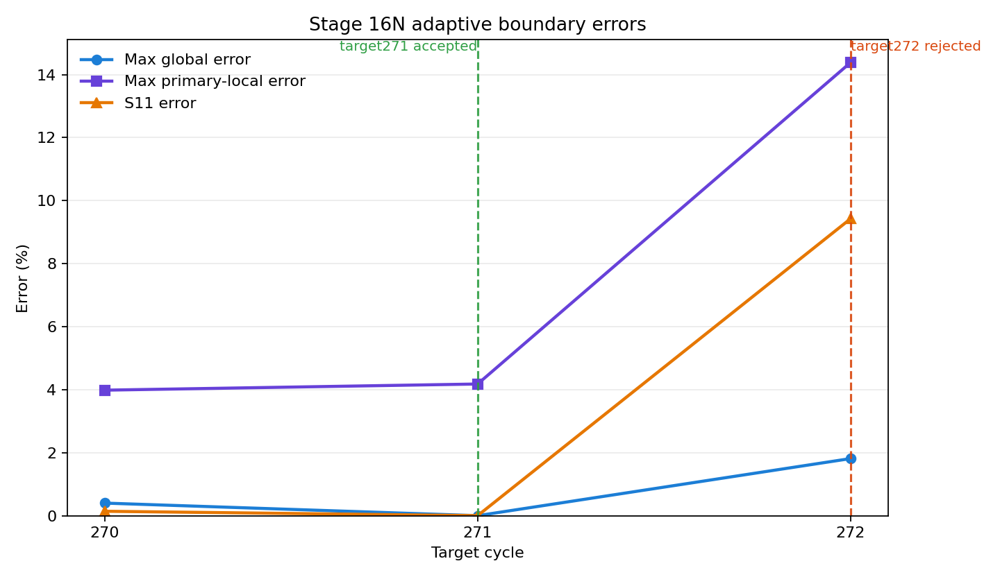
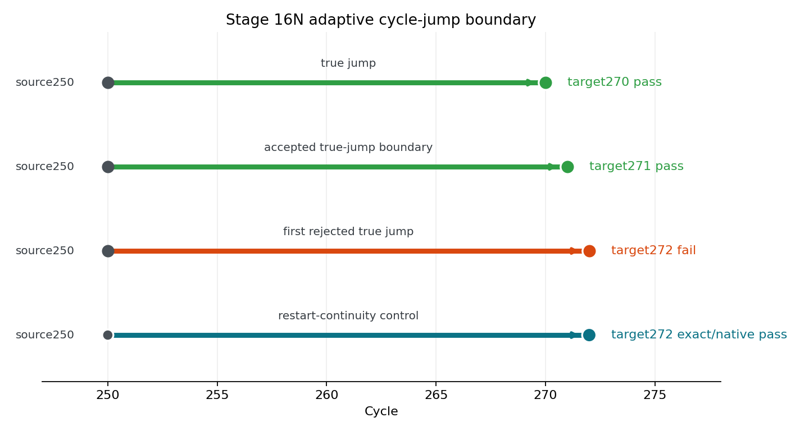

# Adaptive Cycle-Jump Prediction in Abaqus

This minor project packages the Stage 16N restart-based fatigue simulation results into a lightweight adaptive cycle-jump workflow.

The Abaqus/PBS runs provide the classified evidence. The adaptive selector script reads that evidence and identifies the largest accepted jump target and the first rejected target. The Nesnas-Saanouni-style model adds a tolerance-based jump-size calculation using a bounded monitor increment.

## Main result

For the investigated Chaboche UMAT benchmark, the accepted 250-branch extrapolated true-jump boundary is:

```text
source cycle 250 -> target cycle 271 = accepted
source cycle 250 -> target cycle 272 = rejected
```

The exact/native restart control at target272 passed with zero error. Therefore, the target272 failure is localized to extrapolated internal-state prediction, not Abaqus native restart continuity.

## Files

```text
data/stage16n_boundary_summary.csv
scripts/adaptive_jump_selector.py
scripts/nesnas_saanouni_jump_model.py
scripts/plot_boundary.py
figures/error_vs_target.png
figures/cycle_jump_boundary.png
```

## Figures





## Run

From this folder:

```bash
python scripts/adaptive_jump_selector.py
python scripts/nesnas_saanouni_jump_model.py --source-cycle 250 --global-tol 1 --primary-local-tol 5 --s11-tol 1
python scripts/plot_boundary.py
```

Expected selector decision:

```text
Accepted boundary: target271
First rejected extrapolated target: target272
Exact/native restart at target272: pass
```

Expected Nesnas-Saanouni-style model decision:

```text
Final recommended jump:
  target cycle: 271
  skipped cycles: 21
```

## Nesnas-Saanouni-style adaptive model

The implemented model is inspired by Nesnas & Saanouni (2000), *A cycle jumping scheme for numerical integration of coupled damage and viscoplastic models for cyclic loading paths*, DOI `10.1080/12506559.2000.10511493`.

The model uses a normalized monitor ratio:

```text
R = max(global_error / global_tolerance,
        primary_local_error / primary_local_tolerance,
        S11_error / S11_tolerance)
```

A jump target is admissible only when all available true-jump evidence at that target has `status=pass` and `R <= 1`. A first-order cycle-evolution estimate is used to propose the next jump, but already rejected validation evidence is applied as a hard safety cap. For the current benchmark, target272 is already rejected, so the conservative maximum safe jump remains source250 -> target271, i.e. 21 skipped cycles.

## Interpretation

The adaptive decision rule is:

1. Collect classified jump results for each candidate target.
2. Accept a target only when all true-jump evidence at that target passes.
3. Compute a tolerance-normalized monitor ratio for each target.
4. Estimate the next possible jump from the monitor evolution rate.
5. Reject or cap the jump at the first higher target with reproducible true-jump failure.
6. Use exact/native restart control to separate Abaqus restart-continuity error from extrapolated state-prediction error.
7. If exact/native control passes but extrapolated true-jump fails, stop widening targets and redesign the state predictor.

## Project conclusion

Target271 is the accepted adaptive cycle-jump boundary from source cycle 250. Target272 is the first rejected extrapolated true-jump target. Since exact/native target272 restart passes with zero error, the limiting factor is the extrapolated internal-state prediction, not the Abaqus restart path.
